<p align="center">
    
</p>
<h1 align="center">API 接口服务平台</h1>
<p align="center">
    <strong>🫧API 接口服务平台是一个为用户和开发者提供全面 API 接口调用服务的平台</strong>
</p>
<div align="center">
	
    
    
</div>

## 项目介绍 🔝️

**😀 作为用户，您可以根据自己的需求浏览和选择合适的接口，并通过签到/邀请/购买积分来获取接口调用权限。您可以在线进行接口调试，快速验证接口的功能和效果。** 

**💻 作为开发者，我们提供了[客户端SDK](https://github.com/haiqing102/API-sdk)，通过[开发者凭证](https://api.suki.vin/account/center)即可将 API 接口轻松集成到您的项目中，实现更高效的开发和调用。** 

**😽 您可以将自己的接口接入到 API 接口服务平台上，并发布给其他的用户使用。您可以管理自己的各个接口，以便更好地分析和优化接口性能。** 

**👏 我们还提供了详细的[开发者文档](https://doc.suki.vin/)和技术支持，帮助您快速地接入和发布接口。**

**✅ 无论您是用户还是开发者，API 接口服务平台都致力于提供安全、稳定、高效的接口调用服务，帮助您实现更快速、便捷的开发和调用体验。**

## 网站导航 🧭

- **🔗 [API 接口服务平台](https://api.suki.vin)**
- **☘️ [API-frontend 前端](https://github.com/haiqing102/API-frontend)**
- **🐈 [API-platform 后端 ](https://github.com/haiqing102/API-platform)**
- **🌈 [API-sdk 开发工具包](https://github.com/haiqing102/API-sdk)** 
-  **📖 [API-doc 开发者文档 ](https://github.com/haiqing102/API-doc)**


## 目录结构 📑


| 目录                                                     | 描述               |
|--------------------------------------------------------| ------------------ |
| **🐈 [api-backend](./api-backend)**         | API-后端服务模块 |
| **🚌 [api-common](./api-common)**             | API-公共模块 |
| **🚀 [api-gateway](./api-gateway)**         | API-网关服务模块 |
| **🔗 [api-interface](./api-interface)**          | API-接口服务模块 |

## 项目流程 🗺️


## 快速启动 🚀

### 前端

环境要求：Node.js >= 16

安装依赖：

```bash
yarn or npm install
```

启动：

```bash
yarn dev or npm run dev
```

部署：

```bash
yarn build or npm run build
```

### 后端

执行 sql 目录下 api_platform.sql

## 技术选型 🎯

### 前端

- React 18
- Ant Design Pro 5.x 脚手架
- Ant Design & Procomponents 组件库
- Umi 4 前端框架
- OpenAPI 前端代码生成

### 后端

- Spring Boot 2.6.13
- Spring Cloud 2021.0.5
- Spring Cloud Alibaba  2021.0.5.0
- Spring Cloud Gateway 微服务网关
- Dubbo RPC 3.0.15
- MySQL 8.0.31
- 腾讯云 COS 存储
- IJPay-AliPay  支付宝支付
- Swagger + Knife4j 接口文档
- Jakarta.Mail 邮箱通知
- Spring Session Redis 分布式登录
- MyBatis-Plus 及 MyBatis X 自动生成
- Hutool、Apache Common Utils、Gson 等工具库

## 功能介绍 📋

💰**积分**：用于平台接口调用。

| 功能                                                         | <span style="display:inline-block;width: 80px"> 游客 </span> | <span style="display:inline-block;width: 80px">普通用户</span> | <span style="display:inline-block;width: 80px">管理员</span> |
| :----------------------------------------------------------- | :----------------------------------------------------------: | :----------------------------------------------------------: | :----------------------------------------------------------: |
| 访问 **[API 开发者文档](https://doc.suki.vin)**              |                              ✅                               |                              ✅                               |                              ✅                               |
| 接口广场：搜索/浏览接口                                      |                              ✅                               |                              ✅                               |                              ✅                               |
| 邮箱/平台账号：登录/注册                                     |                              ✅                               |                              ✅                               |                              ✅                               |
| 接口在线调试                                                 |                              ❌                               |                              ✅                               |                              ✅                               |
| 使用 [**API-sdk**](https://github.com/haiqing102/API-sdk) 开发工具包 |                              ❌                               |                              ✅                               |                              ✅                               |
| 上传/更新头像                                                |                              ❌                               |                              ✅                               |                              ✅                               |
| 邀请好友/每日签到得积分                                      |                              ❌                               |                              ✅                               |                              ✅                               |
| 绑定/更新/解绑邮箱                                           |                              ❌                               |                              ✅                               |                              ✅                               |
| 积分充值                                                     |                              ❌                               |                              ✅                               |                              ✅                               |
| 支付宝付款                                                   |                              ❌                               |                              ✅                               |                              ✅                               |
| 支付成功邮箱通知(需要绑定邮箱)                               |                              ❌                               |                              ✅                               |                              ✅                               |
| 更新开发者凭证                                               |                              ❌                               |                              ✅                               |                              ✅                               |
| 查询订单明细                                                 |                              ❌                               |                              ✅                               |                              ✅                               |
| 取消/删除订单                                                |                              ❌                               |                              ✅                               |                              ✅                               |
| 接口管理：接口发布/审核/修改/下线等                          |                              ❌                               |                              ❌                               |                              ✅                               |
| 商品管理：商品修改/上下架/删除等                             |                              ❌                               |                              ❌                               |                              ✅                               |
| 用户管理：用户封号/解封/修改等                               |                              ❌                               |                              ❌                               |                              ✅                               |

## 功能展示 ✨

### 登录

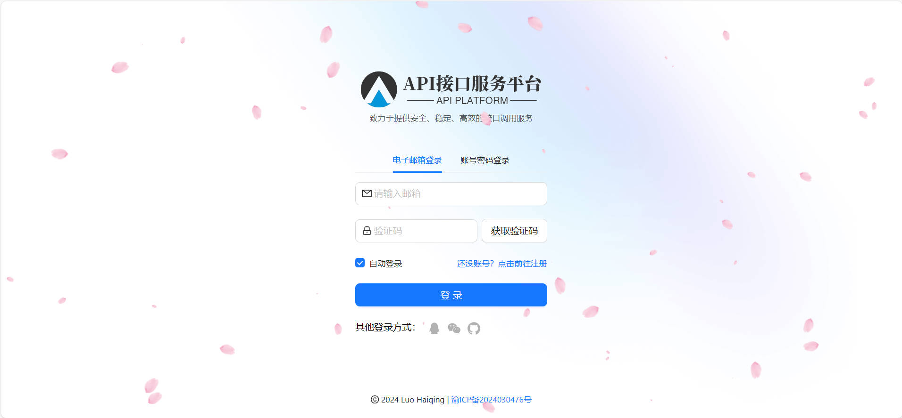

### 注册

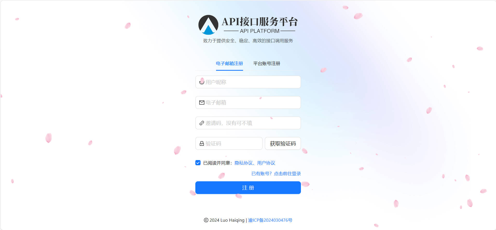

### 首页

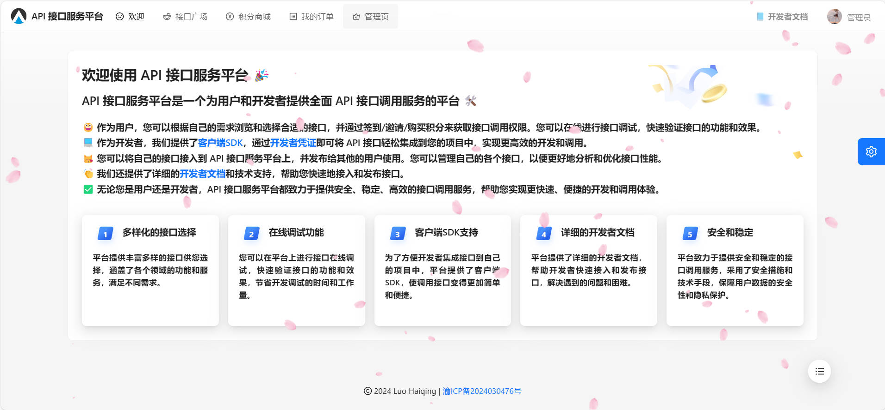

### 接口广场

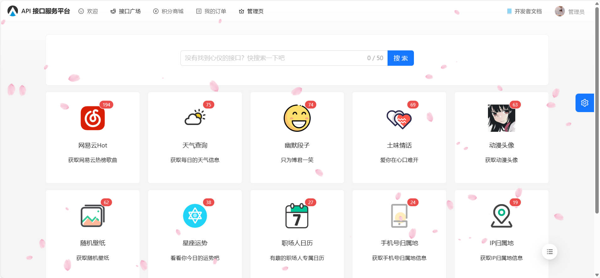

### 接口描述

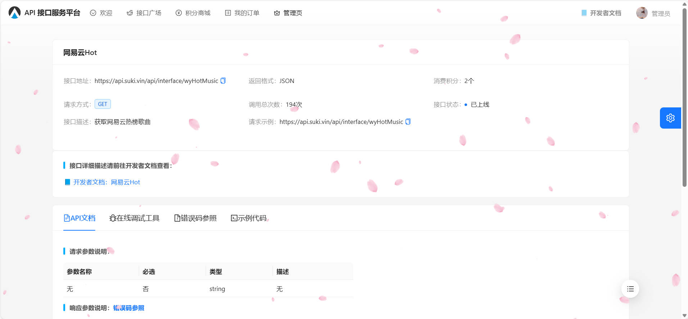

### 在线调试

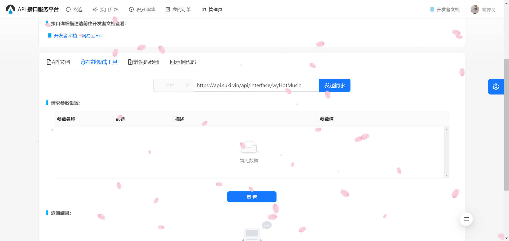

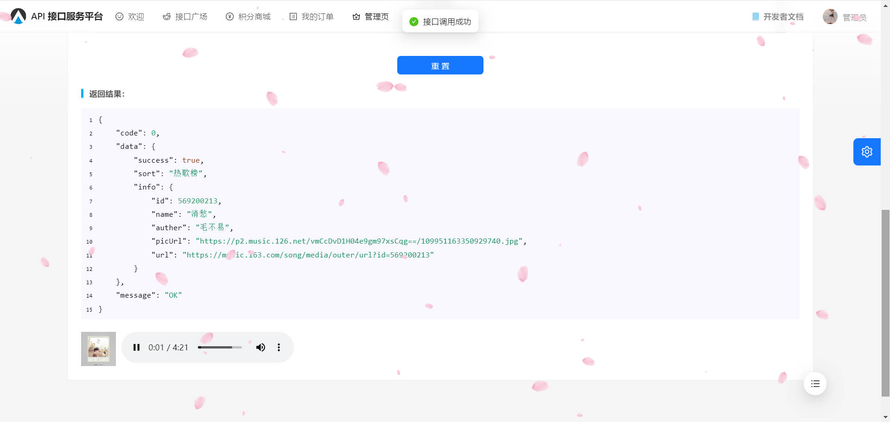

### 积分商城

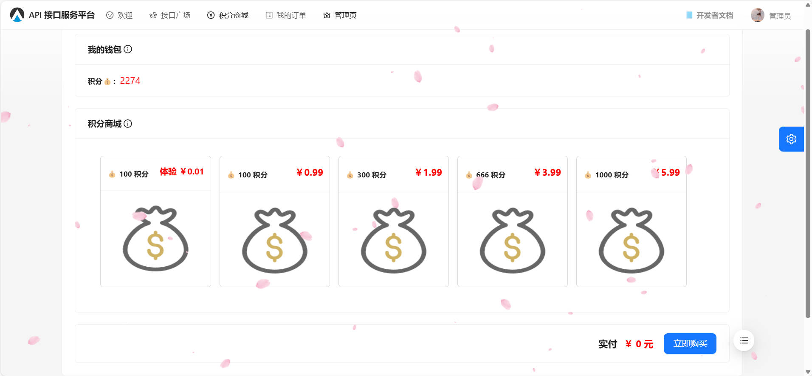

### 我的订单

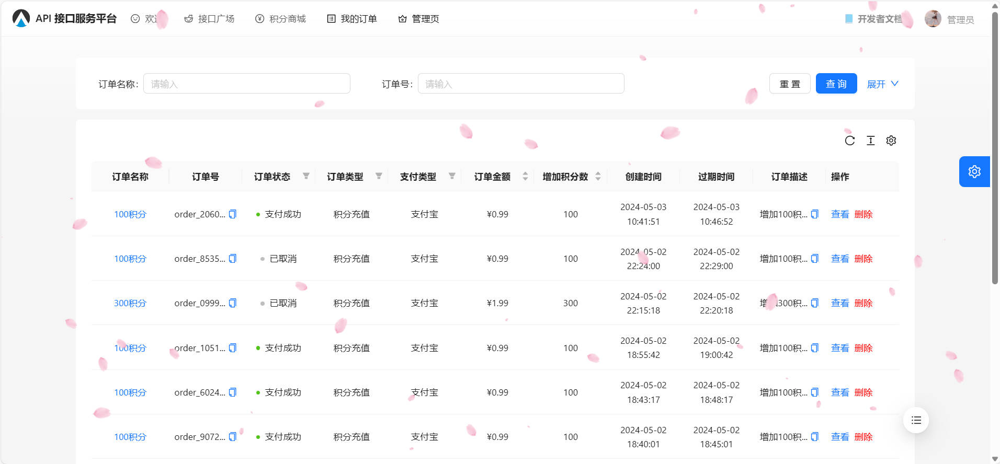

### 个人中心

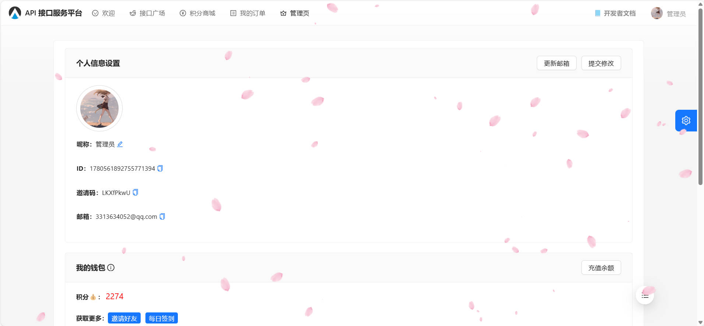

### 支付宝支付

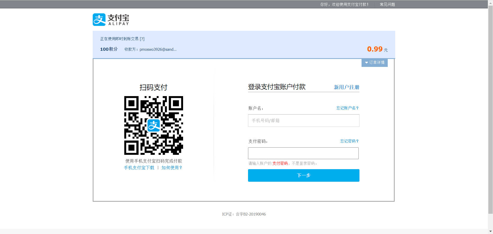

### 好友邀请

#### **发送邀请**

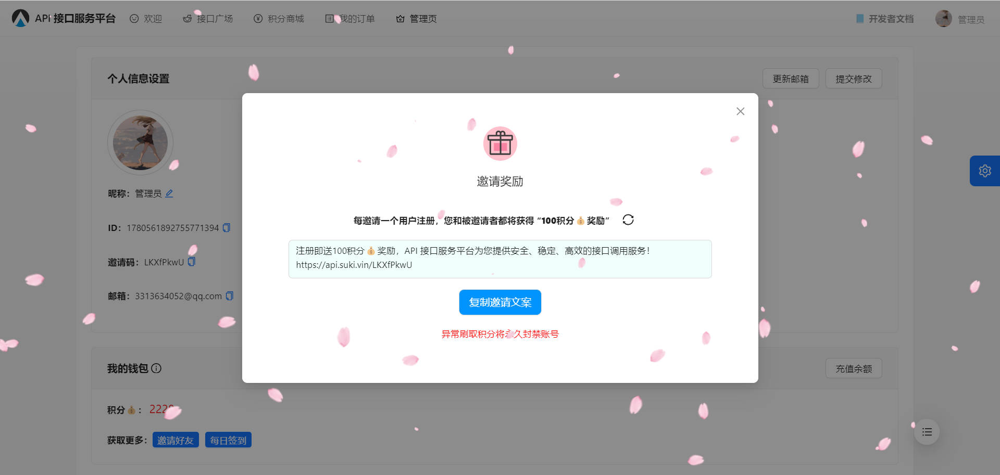

#### **接收邀请**

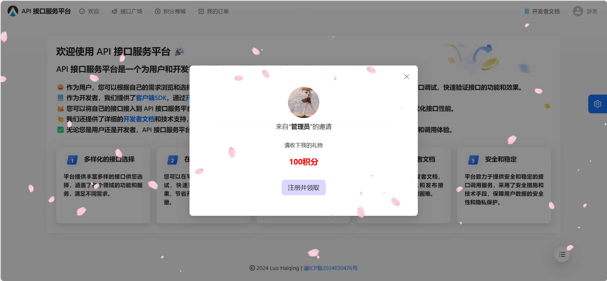

### 主题切换

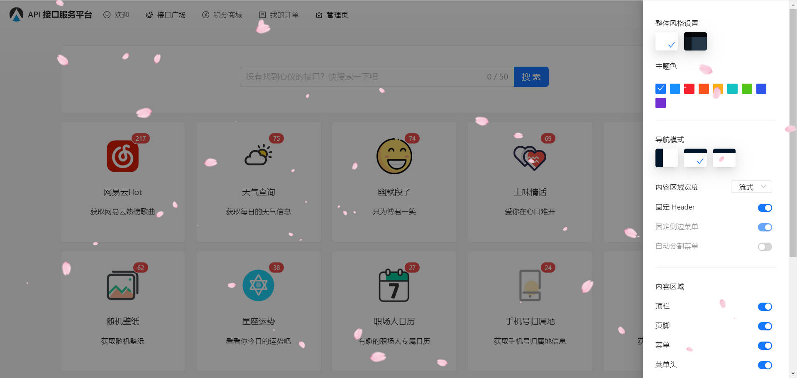